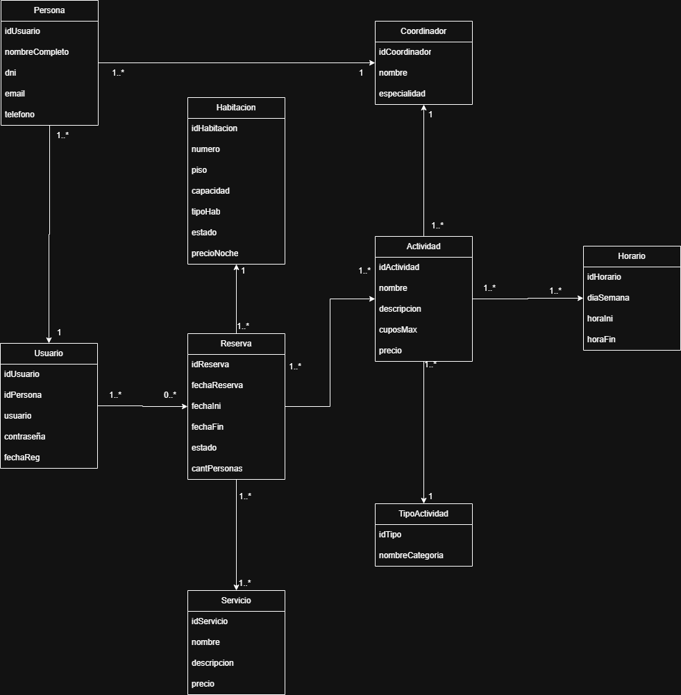

# Resort Grand Line

## Integrantes
- Ramiro Garcia Suarez (51047)
- Carlos Chocobar (50968)
- Alesandroni, Valentino (51415).

## Descripción

## Modelo de Dominio

## Checklist de Requerimientos

### Regularidad
| Requerimiento | Detalle |
| :--- | :--- |
| ABMC simple | 1. [usuario]   2. [habitacion]   3. [servicio] |
| ABMC dependiente | 1. [Recarga del consumo]   2. [Creacion de actividades] |
| CU NO-ABMC | 1. [Control de cupos en actividades para inscribirse]   2. [Reserva de paquete]|
| Listado simple | 1. [Actividades]   2. [Habitaciones]   2. [Servicio] |

### Aprobación Directa
| Requerimiento | Detalle |
| :--- | :--- |
| Todo ABMC | 1. [A terminar] |
| CU Nivel resumen | 1. [Ciclo de Estadía del Huésped]   2. [Gestión Integral de Actividades]|
| Listado complejo | 1. [Lista habitaciones disponibles por fechas] |
| Nivel de acceso | 1. [invitado/usuario/administrador] |
| Manejo de errores |  [obligatorio] |
| Requerimiento extra obligatorio | 1. [Manejo de archivos] |
| publicar el sitio |  [Proximamente] |

