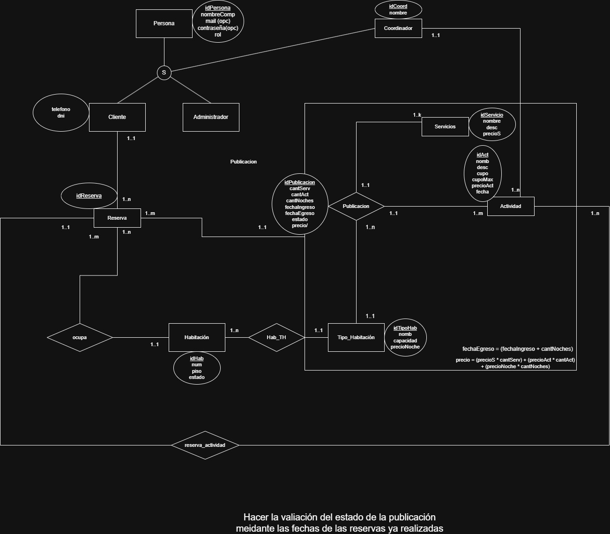

# Resort Grand Line

## Integrantes
- Ramiro Garcia Suarez (51175)
- Carlos Chocobar (50968)
- Alesandroni, Valentino (51415).

## Descripción
El presente proyecto propone un sistema integral para la gestión de reservas de un complejo turístico con tematicas de one piece. La plataforma permite a los administradores diseñar y ofrecer paquetes ('Publicaciones') que combinan estadías con actividades recreativas y servicios adicionales. Los usuarios pueden explorar este catálogo y generar sus reservas de forma autónoma, mientras el sistema automatiza la cotización final y optimiza la asignación de recursos y coordinadores.

## DER

## Checklist de Requerimientos

### Regularidad
| Requerimiento | Detalle |
| :--- | :--- |
| ABMC simple | 1. [Tipo_Habitacion]   2. [Actividad]   3. [servicio] |
| ABMC dependiente | 1. [Publicacion]   2. [Habitacion] |
| CU NO-ABMC | 1. [Reservar publicacion]   2. [Check in]|
| Listado simple | 1. [Publicaciones]   2. [Actividades]   2. [(a definir)] |

### Aprobación Directa
| Requerimiento | Detalle |
| :--- | :--- |
| Todo ABMC | 1. [A terminar] |
| CU Nivel resumen | 1. [Reservar Actividades]   2. []|
| Listado complejo | 1. [Lista habitaciones disponibles por fechas] |
| Nivel de acceso | 1. [invitado/cliente/administrador/coordinador] |
| Manejo de errores |  [obligatorio] |
| Requerimiento extra obligatorio | 1. [Manejo de archivos] |
| publicar el sitio |  [Proximamente] |

PENSAR UN LISTADOS COMPLEJOS Y DOS SIMPLES
